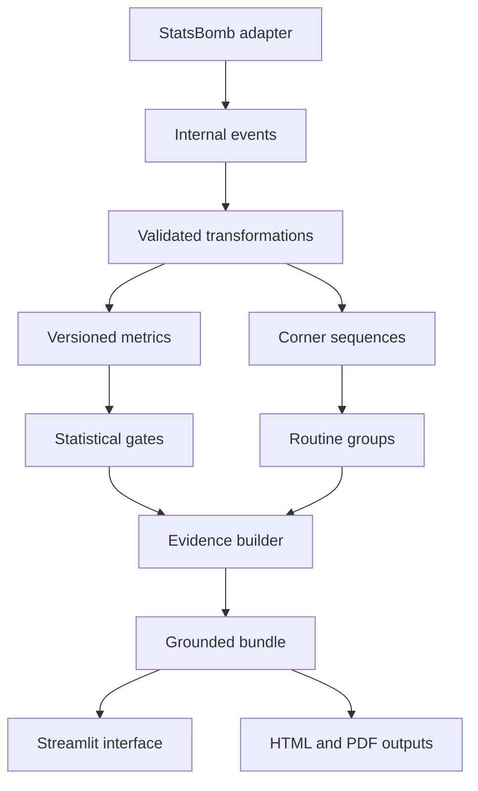

# Architecture

The MVP is a local Python application. It has no database, queue, authentication layer, external LLM, or hosted dependency. Raw acquisition is cache-first. Derived evidence bundles are portable and reviewable without redistributing raw provider files.

Provider-specific parsing stops at the adapter. Metrics, gates, evidence construction, reporting, and presentation consume internal models.

The opponent-preparation layer (`opponent.py`) consumes typed evidence sequences rather than provider records. It owns routine-family grouping, window denominators, uncertainty, quality gates, and stability labels. The Streamlit app only selects state and renders the resulting structured comparisons. The HTML briefing uses the same structured values and evidence IDs, so it cannot silently diverge from the interface.
